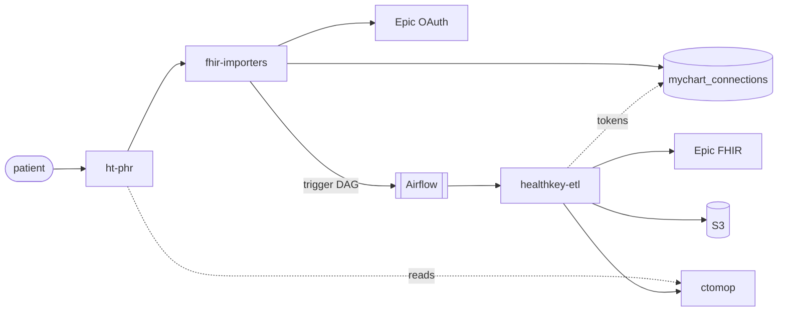
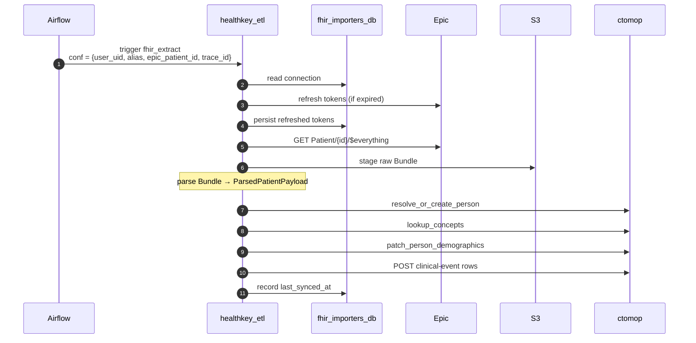

# FHIR patient data fetching — data flow

**Status**: requirements / target state. **Treat this document as the Definition of Done.** Grep for `SHALL`/`SHOULD`/`MUST` for testable cross-service contracts.

This is the feature this project exists to deliver: a patient connects a MyChart (Epic SMART-on-FHIR) account from a host SPA; their clinical record is pulled from Epic, parsed, and pushed to a patient-data store (ctomop). Four components collaborate. This document describes how data flows between them — participants, edges, sequences, and the cross-service contracts the flows depend on. Service internals live in the topic files alongside this one ([fhir-importers](README.md)) and in [`../healthkey-etl/`](../healthkey-etl/README.md).

## Participants



- **fhir-importers** — OAuth handler + federation remote. See [`README.md`](README.md).
- **healthkey-etl** — Airflow pipeline that pulls FHIR, parses, pushes to ctomop. See [`../healthkey-etl/`](../healthkey-etl/README.md).
- **ctomop** (consumed) — patient-data store. Wire contract: [`../healthkey-etl/ctomop-integration.md`](../healthkey-etl/ctomop-integration.md). Black box.
- **ht-phr** (consumes us) — host SPA. Wire contract: [`frontend-remote.md`](frontend-remote.md). Black box.

## Coupling map

| Edge | Mechanism |
|---|---|
| ht-phr → fhir-importers (UI) | Module Federation remote ([`frontend-remote.md`](frontend-remote.md)) |
| ht-phr → fhir-importers (API) | bearer-authenticated REST ([`api.md`](api.md), [`../openapi.yaml`](../openapi.yaml)) |
| fhir-importers → Airflow | Airflow REST API ([`healthkey-etl-integration.md`](healthkey-etl-integration.md)) |
| fhir-importers ↔ Epic | SMART-on-FHIR OAuth ([`token-management.md`](token-management.md)) |
| **fhir-importers postgres ↔ healthkey-etl** | **shared DB (single exception, see below)** |
| healthkey-etl ↔ Epic | SMART-on-FHIR FHIR REST + token refresh ([`../healthkey-etl/fhir-operations.md`](../healthkey-etl/fhir-operations.md), [`../healthkey-etl/token-refresh.md`](../healthkey-etl/token-refresh.md)) |
| healthkey-etl ↔ S3 | object store |
| healthkey-etl → ctomop | HTTP + bearer service token ([`../healthkey-etl/ctomop-integration.md`](../healthkey-etl/ctomop-integration.md)) |
| ht-phr → ctomop | HTTP + bearer user token |

**Shared-DB exception**: `mychart_connections` is written by fhir-importers and read+updated by healthkey-etl via direct SQL. Justification: token refresh requires `SELECT … FOR UPDATE` row locking across writer and refresher; placing an HTTP API in front would either lose the lock semantics or reimplement them. Accepted because both services are developed and deployed by the same team. Every other inter-component edge is HTTP.

## Data flows

### OAuth handshake

```mermaid
sequenceDiagram
    autonumber
    participant ht_phr
    participant fhir_importers
    participant Epic
    participant Airflow

    ht_phr->>fhir_importers: GET /organizations
    ht_phr->>fhir_importers: POST /auth/start (alias)
    fhir_importers->>Epic: SMART discovery
    fhir_importers-->>ht_phr: authorization_url + state
    ht_phr->>Epic: redirect
    Epic->>ht_phr: redirect /auth/finish?code&state
    ht_phr->>fhir_importers: POST /auth/finish (code, state)
    fhir_importers->>Epic: token exchange (PKCE + JWT)
    Epic-->>fhir_importers: access + refresh tokens + patient_id
    fhir_importers->>fhir_importers: persist mychart_connections (encrypted)
    fhir_importers->>Airflow: trigger fhir_extract
    fhir_importers-->>ht_phr: FinishOAuthResponse (metadata; no tokens)
```

**Contracts**:
- PKCE with `code_challenge_method=S256` on every authorization.
- `client_assertion` is an RS256 JWT signed with the per-tenant private key.
- OAuth `state` is ≥256-bit cryptographic random; stored in Redis with TTL ≤10 min; consumed atomically on `/finish`.
- Tokens SHALL NOT appear in any response body or UI payload.
- DAG triggering on `/finish` is best-effort: a failed trigger SHALL NOT roll back the persisted connection; the user re-triggers via re-sync.

Handler step-by-steps: [`token-management.md`](token-management.md), [`healthkey-etl-integration.md`](healthkey-etl-integration.md).

### Data import



**Contracts**:
- DAG conf SHALL include `user_uid`, `organization_alias`, `epic_patient_id`, `trace_id`, all required.
- The Bundle SHALL be staged to S3 before parsing begins; re-runs of the parse step SHALL be possible against the staged artifact without re-fetching from Epic.
- `last_synced_at` SHALL be written only after every parsed row has been successfully pushed.
- Provenance source SHALL default to `EHR_SYNC`.

Implementation: [`../healthkey-etl/dag-topology.md`](../healthkey-etl/dag-topology.md), [`../healthkey-etl/fhir-operations.md`](../healthkey-etl/fhir-operations.md), [`../healthkey-etl/parsing.md`](../healthkey-etl/parsing.md).

## Cross-service contracts

Contracts that bind multiple services and don't fit cleanly in one folder.

### Token cipher

Tokens in `mychart_connections` SHALL be Fernet ciphertext. The key SHALL come from `TOKEN_ENCRYPTION_KEY`, set **identically in both services**. A comma-separated list MAY support rotation. Plaintext tokens SHALL exist only in process memory.

### Token refresh and locking

Refresh is performed by **healthkey-etl**; fhir-importers does not refresh after the initial `/auth/finish` exchange. The invariants:

- Refresh SHALL acquire a row-level lock on the `mychart_connections` row before reading `refresh_token`, and SHALL hold the lock until refreshed tokens are persisted (single transaction).
- Epic `invalid_grant` SHALL be treated as re-authentication required; the connection SHALL be flagged and the run SHALL abort.
- Other 4xx/5xx on refresh SHALL be retried at the orchestration layer.

Implementation: [`../healthkey-etl/token-refresh.md`](../healthkey-etl/token-refresh.md). Per-service JWT signing material: [`token-management.md`](token-management.md), [`../healthkey-etl/token-refresh.md`](../healthkey-etl/token-refresh.md).

## Convergence properties

### Idempotency

Re-running the same `(user_uid, organization_alias, epic_patient_id)` SHALL NOT produce duplicates. Dedup lives at ctomop's natural-key layer; healthkey-etl SHALL NOT track its own "already written" state. `last_synced_at` is informational, not a watermark for incremental sync (which uses Epic's `_lastUpdated`).

### Concurrent triggers

Multiple sync triggers for the same `(user_uid, organization_alias)` MAY race — re-sync clicked twice, push and scheduled triggers overlapping. The system SHALL converge:

- Token refresh serialises via the `SELECT … FOR UPDATE` lock; racing runs share the refreshed token rather than each calling Epic.
- Duplicate row writes are absorbed by ctomop's natural-key idempotency.
- `last_synced_at` is written only on success; the last successful run wins (monotonic-on-success, not last-writer-wins).

The system SHALL NOT depend on the host UI to prevent concurrent triggers. The host SHOULD debounce, but the backend tolerates burst triggers.

## Observability: trace_id

Each service implements its own observability. A `trace_id` is the system-level mechanism for following an end-to-end flow.

- Generated at the entry of each user-initiated flow:
  - `POST /auth/start` — stored alongside the OAuth state in Redis; carried through the Epic redirect and consumed by `/auth/finish`.
  - `POST /epic/connections/{alias}/sync` — standalone request, generated at handler entry.
- Passed to the Airflow DAG trigger as a conf field.
- Propagated as `X-Trace-Id` on every outbound HTTP request from healthkey-etl.
- Included in every structured log line both services emit while handling that flow.
- Globally-unique (UUID v4 or equivalent).

Per-service propagation: [`observability.md`](observability.md), [`../healthkey-etl/observability.md`](../healthkey-etl/observability.md).

## Contract evolution

Anticipated changes; not required for the current target state. Listed here so per-service implementations stay shaped for them.

- **Bulk-list POSTs on ctomop CRUDs**. healthkey-etl's ctomop client SHALL be shaped today so switching from per-row to bulk is a drop-in change. Detail: [`../healthkey-etl/performance.md`](../healthkey-etl/performance.md).
- **Non-Firebase identity providers**. If supported, `mychart_connections` SHALL grow an explicit `actor_iss` column. Detail: [`token-management.md`](token-management.md).
- **Scheduled DAGs**. `fhir_incremental_sync` and `fhir_token_monitor` return to scope when periodic syncs become a product requirement; both SHALL enumerate `mychart_connections` via direct SQL read from fhir-importers's postgres. Detail: [`../healthkey-etl/dag-topology.md`](../healthkey-etl/dag-topology.md).
